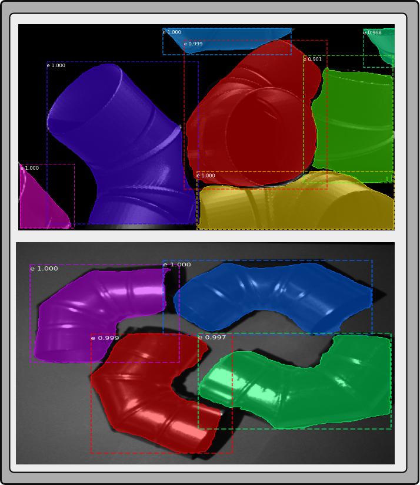

# Image Segmentation

<a rel="license" href="http://creativecommons.org/licenses/by-nc-nd/4.0/">

### Welcome to image estimation pipeline.
**Author:** Artur Cordeiro


# <a name="index"></a> Index
* [Overview](#overview)
* [Installation](#installation)
* [Configuration Files](docs/configuration.md)
* [Usage](docs/usage.md)
* [Heuristics](docs/heuristic.md)

<a name="overview"></a> Overview

------------------------------

Ros package to detect objects and segment 2D data.
- Input: rgb | rgb-d | grayscale image
- Output: message with segmented image and number of objects (instances)

This package implements a system allowing the use of tensorflow and pytorch neural networks, specifically Mask R-CNN and yolov8. Before the inference
it is possible to implement different image processing methods, such as, crop, clahe and denoise. Independent on the type of neural network the publish result
is always a image message with a segmentation or detection and the total number of encountered objects.

<p align="center">
  
</p>
<p align="center">
Image segmentation results.
</p>


# <a name="Prerequisites"></a> Prerequisites

It is recommended to create a PythonEnviroment to setup the package. This avoid dependencies issues with your native system. To create it and activated it check [this](https://packaging.python.org/en/latest/guides/installing-using-pip-and-virtual-environments/)

1. [CUDA](https://developer.nvidia.com/cuda-downloads) or [CUDA Setup](https://github.com/ItzMeJP/help_tools_and_templates/blob/main/Ubuntu/nvidia_30series_driver_and_cuda_setup.md) (CUDA is only needed to speedup the segmentation processin time. To perform this set arg in config.yaml device_GPU)
2. [Tensorflow](https://www.tensorflow.org/install/pip) (python enviroment recommended)
3. [Pytorch](https://pytorch.org/get-started/locally/) (python enviroment recommended)


#### System tested:
- Ubuntu 20.04
- Ros Noetic
- gcc and g++ 9.4

# <a name="installation"></a> Installation

1. [Install catkin-tools](https://catkin-tools.readthedocs.io/en/latest/installing.html)
2. git clone image_segmentation_skill
3. Build the image segmentation msg package (**if you are using python enviroment do not activate it since the msgs  depends on ROS**)
 ```
 catkin build image_segmentation_skill_msgs
```
4. Installing ultralytics (python enviroment recommended)
```
git clone https://github.com/arturjcordeiro/ultralytics.git
cd ultralytics
pip install -e .
```
5. pip3 install -r requirements.txt (python enviroment recommended)
6. git clone image_segmentation_demos
7. git clone image_segmentation_dataset
